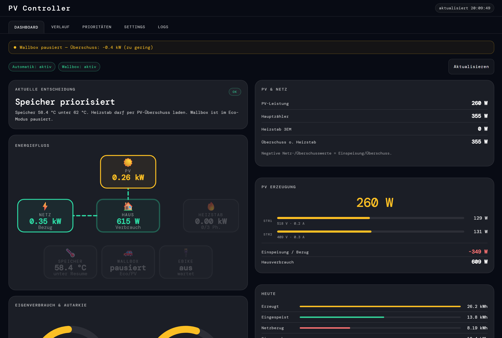
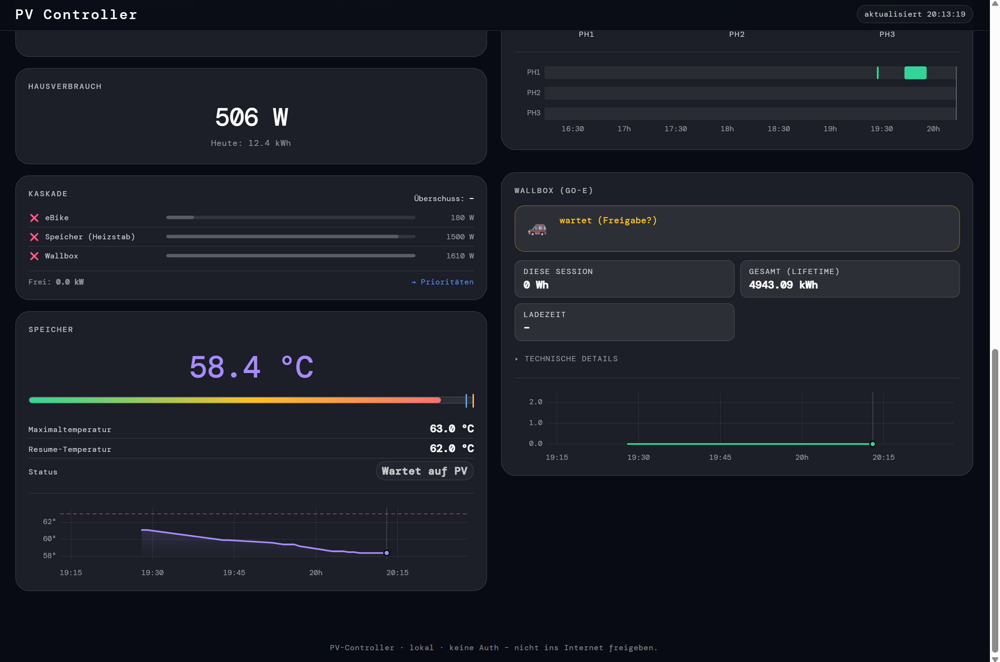

# PV-Controller - Überschussmanagement Solax Wechselrichter, go-e Wallbox, Heizstab mit Shelly & weitere Shelly

> 🤖 100% built with [Claude Code](https://claude.ai/code) — from first line to final commit.




## Was kann der PV Controller?

**Intelligente PV-Überschuss-Steuerung für dein Zuhause.** Verteilt jeden Watt Solarstrom automatisch auf deine Verbraucher – in der Reihenfolge die du per Drag & Drop festlegst. Ziel: maximaler Eigenverbrauch, minimale Netzeinspeisung.

### Features

**Echtzeit-Dashboard**
- Energiefluss-Diagramm mit Haus in der Mitte – alle Flüsse auf einen Blick
- PV-Erzeugung, Netzeinspeisung/-bezug, Hausverbrauch live
- Eigenverbrauchsquote & Autarkiegrad als Gauges
- Speichertemperatur mit Verlaufsgraph
- Heizstab-Phasen-Visualisierung
- Wallbox-Status und Ladehistorie

**Prioritäts-Kaskade mit Drag & Drop**
- Lege per Drag & Drop fest, wer den PV-Überschuss zuerst bekommt
- Das System schaltet automatisch von oben nach unten ein – solange Überschuss da ist
- Heizstab, Wallbox und Shelly-Geräte in einer gemeinsamen Prioritätsliste
- Beispiel: Bei 5 kW Überschuss → eBike (180W) ✅ → Heizstab 3 Phasen (4.5kW) ✅ → Rest ins Netz

**Shelly Smarthome Integration**
- Shelly Gen1 + Gen2 Geräte per IP hinzufügen
- Verbindungstest direkt aus der UI
- Automatisches Schalten bei PV-Überschuss
- Echte Leistungsmessung (wenn vom Shelly unterstützt)

**Heizstab-Steuerung (3 Phasen)**
- Steuert bis zu 3 Shelly-Schaltrelais für den Heizstab
- Phasenweise Zuschaltung je nach Überschuss
- Speicher-Temperaturüberwachung mit Hysterese

**Wallbox go-eCharger**
- Eco/PV-Überschuss-Laden
- Kaskade gibt Wallbox frei wenn genug Überschuss nach höher priorisierten Geräten
- Manuelles Laden bleibt jederzeit möglich

**Lokale Web-UI**
- Dark Theme Dashboard – optimiert für Desktop und Mobile
- Settings-Editor für alle Geräte-IPs direkt im Browser
- Log-Viewer und Verlaufs-Tab
- Läuft komplett lokal – keine Cloud, keine Registrierung, keine Daten die das Haus verlassen

### Unterstützte Hardware

- **Wechselrichter:** Solax (Modbus TCP via PocketWifi)
- **Heizstab:** 3× Shelly Schaltrelais (Plug S, 1PM, Plus 1PM, etc.)
- **Warmwasserspeicher:** Shelly Temperatursensor
- **Hauptzähler:** Shelly 3EM / Pro 3EM
- **Wallbox:** go-eCharger (HTTP API)
- **Smarthome:** Beliebige Shelly Gen1 + Gen2 Geräte

## Schnellstart mit Docker

```bash
# 1. Konfiguration anlegen
cp config.example.json config.json
nano config.json        # IPs und Passwort eintragen

# 2. Starten
docker compose up -d

# 3. Dashboard öffnen: http://<server-ip>:8000
```

**Updates**

```bash
git pull && docker compose up -d --build
```

**Logs / Stopp**

```bash
docker compose logs -f   # Live-Logs
docker compose down      # Stoppen
```

> Persistent: DB und Logs liegen in `./data/`, Konfiguration in `./config.json`.
> Der Controller (`main.py`) läuft jede Minute automatisch via Cron im Container.

---

## Was der Controller macht

Pro Lauf (Cron):

1. Liest OpenHAB (PV-Leistung).
2. Liest Shelly Hauptzähler, Heizstab-3EM, Speichertemperatur,
   Phasenstatus PH1/PH2/PH3.
3. Berechnet den realen Netzüberschuss ohne Heizstab:
   `surplus = main_meter_total_power - heater_meter_total_power`
   (negative Werte = Einspeisung).
4. Klassifiziert die Speichertemperatur (`BELOW_RESUME` /
   `HYSTERESIS_BAND` / `AT_OR_ABOVE_MAX`).
5. Entscheidet pro Phase AN/AUS/UNCHANGED nach den Schwellen aus
   `config.json` und führt die Schaltbefehle aus.
6. Liest den go-eCharger-Status (`fup`, `frc`, `alw`, `car`, `amp`) und
   pausiert/freigibt die Wallbox abhängig von Speichertemperatur und
   Eco/PV-Modus.

## Aktivierung des Controllers

Das alte OpenHAB-Item `Heizstab_PV_uebersteuern` wird **nicht mehr verwendet**.
Steuerung läuft komplett über `config.json`:

| Konfiguration                 | Bedeutung                                                          |
|-------------------------------|--------------------------------------------------------------------|
| `runtime.enabled = true`      | Controller darf aktiv steuern (Shellys schalten)                   |
| `runtime.enabled = false`     | Controller beobachtet nur, ändert keine Phasen, loggt alles        |
| `runtime.dry_run = true`      | Entscheidungen werden berechnet und geloggt, aber nichts geschaltet|
| `runtime.dry_run = false`     | Entscheidungen werden tatsächlich an die Shellys geschickt         |

Bei `enabled=false` werden alle Werte trotzdem gelesen und geloggt – nur
eben keine Schaltbefehle gesendet. `dry_run` ist der Sicherheits-Test, mit
dem man das Verhalten gefahrlos beobachten kann.

OpenHAB wird in Phase 1 nur noch für die aktuelle PV-Leistung
(`solaxbb_local_pv_power`) gelesen.

## Logik im Detail

### Temperaturlogik

Der Controller kennt **keine Tageszeit-/Morgenfensterlogik** mehr. Es gibt
genau zwei Temperaturwerte:

- `storage_max_temp` – harte Obergrenze.
- `storage_temp_hysteresis` – wie weit der Speicher abkühlen muss, bevor
  wieder neue Phasen eingeschaltet werden dürfen.

Daraus ergibt sich `heat_resume_temp = storage_max_temp - storage_temp_hysteresis`.

Drei Bereiche, geloggt als `Temperaturstatus`:

| Bereich                                                                | Status              | Verhalten                                                        |
|------------------------------------------------------------------------|---------------------|------------------------------------------------------------------|
| `storage_temp >= storage_max_temp`                                     | `AT_OR_ABOVE_MAX`   | Alle Phasen AUS                                                  |
| `heat_resume_temp < storage_temp < storage_max_temp`                   | `HYSTERESIS_BAND`   | Keine **neuen** Phasen ON; laufende dürfen bei zu wenig Überschuss aus |
| `storage_temp <= heat_resume_temp`                                     | `BELOW_RESUME`      | Volle PV-Überschusslogik, frei AN/AUS                            |

Beispiel mit `storage_max_temp=63 °C` und `storage_temp_hysteresis=1 °C`:

- ab `63 °C` → alle Phasen AUS.
- zwischen `62 °C` und `63 °C` → keine neuen Phasen ein, laufende
  Phasen dürfen bei zu wenig Überschuss aus.
- bei `≤ 62 °C` → volle PV-Überschusslogik darf wieder AN/AUS schalten.

`storage_temp_hysteresis = 0` deaktiviert das Hysteresefenster effektiv:
es gibt nur noch `BELOW_RESUME` (alles erlaubt) und `AT_OR_ABOVE_MAX`
(alles aus).

### PV-Überschusslogik pro Phase (PHx)

- AN, wenn `surplus <= -min_pv_power_phx` **und** `pv_power >= min_pv_power_phx`.
- AUS, wenn `surplus > -min_pv_power_phx`.

Defaults: PH1 ≥ 1500 W, PH2 ≥ 3000 W, PH3 ≥ 4500 W.

### Wallbox (Phase 2: go-eCharger)

Default: `http://192.168.x.x`. Der Controller liest den Status mit
Filter `fup,frc,alw,car,amp,acs` und entscheidet anschließend.

Bedeutung der go-e-Felder:

- `fup` — `usePvSurplus`, Eco/PV-Überschussmodus aktiv.
- `frc` — `forceState`. **Nur** `0` (neutral, an die go-e-Logik
  zurückgeben) oder `1` (off / pausiert) werden vom Controller gesetzt.
  `frc=2` (force ON) wird **nie** geschrieben — sonst würde der
  Controller das Laden erzwingen.
- `alw` — Auto darf aktuell laden.
- `car` — Fahrzeugstatus.
- `amp` — gewünschtes Ampere-Limit.
- `acs` — `accessControlState`. `0` = freigegeben, `1` = wartet auf
  manuelle Freigabe (App-Knopfdruck). Der Controller setzt `acs=0`
  automatisch, sobald die Wallbox laden darf (`frc=0` bzw. Speicher
  ≥ release-Schwelle) und gerade noch `acs=1` ansteht.

Regeln:

- `wallbox.enabled = false` → Wallbox wird nie gelesen oder geschaltet.
- `only_control_when_pv_surplus_active = true` und `fup = false` →
  **nicht anfassen** (manuelles/normales Laden bleibt unbeeinflusst).
- `storage_temp < pause_below_storage_temp` und `fup = true` →
  Wallbox pausieren (`frc=1`), außer bereits 1.
- `storage_temp >= release_above_storage_temp` und `fup = true` →
  Wallbox freigeben (`frc=0`), außer bereits 0.
- Dazwischen → Zustand beibehalten.
- Auto-Unlock: zusätzlich zum `frc=0`-Pfad — wenn die Wallbox laden
  darf (Ziel oder aktueller `frc=0`) und `acs=1` (manuelle Freigabe
  ausstehend), setzt der Controller `acs=0`. Damit entfällt der
  Knopfdruck in der go-e App.
- `dry_run` → kein `set`-Request, nur `DRY-RUN: would set go-e
  forceState to X` bzw. `accessState to X`.
- `runtime.enabled = false` → keine `set`-Requests.
- Bei Fehlern (`go-e` nicht erreichbar, JSON kaputt) → `fail_safe = no_change`,
  also keine Änderung.

Empfohlene Schwellen (passen 1:1 zur Speicherlogik mit
`storage_max_temp=63 °C`, `storage_temp_hysteresis=1 °C`):

- `pause_below_storage_temp = 62 °C`
- `release_above_storage_temp = 63 °C`

Damit ergibt sich:

- Speicher `< 62 °C` → Wallbox pausieren (`frc=1`). Speicher hat
  Vorrang, Heizstablogik darf parallel weiter laden.
- Speicher `>= 63 °C` → Wallbox freigeben (`frc=0`). Speicher ist warm,
  PV-Überschuss kann ans Auto.
- Speicher `62 … 63 °C` → Wallboxzustand halten (Mittelband). Vermeidet
  Schaltspielen genau am Übergang, an dem auch die Heizstäbe in der
  Hysterese hängen.

## Installation

```bash
cd /home/openhabian/pvcontroller
python3 -m venv .venv
source .venv/bin/activate
pip install -r requirements.txt
```

Konfiguration anpassen: `config.json`.

## Nutzung

Einmaliger Lauf:

```bash
python3 /home/openhabian/pvcontroller/main.py
```

Dry-Run (schaltet nichts, loggt nur):

```bash
python3 /home/openhabian/pvcontroller/main.py --dry-run
```

Anderen Config-Pfad verwenden:

```bash
python3 /home/openhabian/pvcontroller/main.py --config /pfad/zur/config.json
```

## Cronjob

Beispiel: alle 2 Minuten ausführen.

```cron
*/2 * * * * /home/openhabian/pvcontroller/.venv/bin/python /home/openhabian/pvcontroller/main.py >> /home/openhabian/pvueberschuss/pv-controller.cron.log 2>&1
```

## Konfiguration (`config.json`)

| Pfad                              | Bedeutung                                                |
|-----------------------------------|----------------------------------------------------------|
| `openhab.base_url`                | OpenHAB REST-Basis                                       |
| `openhab.pv_power_item`           | OpenHAB-Item für aktuelle PV-Leistung                    |
| `shelly.ph1_url` … `ph3_url`      | Shelly Plugs der drei Heizstab-Phasen                    |
| `shelly.storage_url`              | Shelly Plus mit Speicher-Temp-Add-On                     |
| `shelly.main_meter_url`           | Shelly 3EM Hauptzähler                                   |
| `shelly.heater_meter_url`         | Shelly 3EM nur am Heizstab                               |
| `heater.phase_power_w`            | nominale Leistung pro Phase (~1500 W)                    |
| `heater.storage_max_temp`         | harte Obergrenze (alle Phasen AUS, sobald erreicht)      |
| `heater.storage_temp_hysteresis`  | Abkühlung in K, bevor wieder neue Phasen ON dürfen       |
| `heater.min_pv_power_ph[1..3]`    | Schwellen für Überschuss & PV-Leistung pro Phase         |
| `runtime.enabled`                 | wenn `false`, beobachtet der Controller nur (kein Schalten) |
| `runtime.dry_run`                 | wenn `true`, werden keine Shellys geschaltet             |
| `runtime.request_timeout_seconds` | HTTP-Timeout für alle Requests                           |
| `runtime.log_file`                | Pfad zur Logdatei (Rotating, 5×5 MB)                     |
| `simulation.enabled`              | wenn `true`, lokale Tests ohne echte Geräte (siehe unten) |
| `simulation.pv_power`             | simulierte PV-Leistung in W                              |
| `simulation.main_meter_power`     | simulierte Hauptzähler-Leistung in W (negativ = Einspeisung) |
| `simulation.heater_meter_power`   | simulierte Heizstab-Leistung in W                        |
| `simulation.storage_temp`         | simulierte Speichertemperatur in °C                      |
| `simulation.ph1_on/ph2_on/ph3_on` | simulierter Schaltzustand der Phasen                     |
| `wallbox.enabled`                 | wenn `false`, Wallbox wird nicht angefasst               |
| `wallbox.url`                     | Basis-URL des go-eCharger (z. B. `http://192.168.x.x`) |
| `wallbox.only_control_when_pv_surplus_active` | wenn `true`, Wallbox nur bei `fup=true` schalten |
| `wallbox.pause_below_storage_temp` | Speicher-Temp, unter der die Wallbox pausiert wird (`frc=1`) |
| `wallbox.release_above_storage_temp` | Speicher-Temp, ab der die Wallbox freigegeben wird (`frc=0`) |
| `wallbox.request_timeout_seconds` | HTTP-Timeout für go-e Requests                          |
| `wallbox.fail_safe`               | aktuell `no_change` — bei Fehlern keine Schaltbefehle    |

## Simulationsmodus

Mit `simulation.enabled = true` lassen sich Schwellen und Temperaturlogik
lokal testen, ohne OpenHAB oder Shellys anzusprechen:

- Es werden **keine** echten Geräte gelesen.
- Es werden **keine** Schaltbefehle gesendet (`dry_run` wird intern erzwungen).
- Stattdessen werden die Werte aus `simulation.*` verwendet.
- Der Lauf loggt:
  `Simulation mode active. No real devices will be read or switched.`

So lassen sich z. B. die Grenzen für PH1/PH2/PH3 oder die Übergänge
zwischen `BELOW_RESUME`, `HYSTERESIS_BAND` und `AT_OR_ABOVE_MAX` gezielt
prüfen.

## Logs

Die Logdatei (Default: `/home/openhabian/pvueberschuss/pv-controller.log`)
enthält pro Lauf u. a.:

- Start-/Endemarker
- `Runtime: enabled=… dry_run=… simulation=…`
- `Temperaturlogik: max=… °C, hysteresis=… °C, resume<=… °C`
- Alle Messwerte (PV, Hauptzähler, Heizstab, Überschuss ohne Heizstab,
  Speicher-Temp, Phasenstatus PH1/PH2/PH3)
- `Temperaturstatus: BELOW_RESUME | HYSTERESIS_BAND | AT_OR_ABOVE_MAX`
- Pro Phase: `Decision PHx: state=… -> ACTION` plus zweite Zeile `Reason: …`
- Wallbox-Block: `Wallbox: enabled=… url=…`, `Wallbox-Status: fup=… frc=… alw=… car=… amp=…`,
  `Wallbox Decision: action=… target_force_state=…` plus `Reason: …`
- Hinweis bei `DRY-RUN`

## Phase 3: Weboberfläche

Lokales Dashboard mit FastAPI. Keine Auth, keine externen CDN-Assets,
alles aus `web/` ausgeliefert.

### Installation

```bash
cd /home/openhabian/pvcontroller
python3 -m venv .venv
.venv/bin/pip install -r requirements.txt
```

### Start

```bash
.venv/bin/uvicorn web:app --host 0.0.0.0 --port 8099
```

Aufruf im Browser: `http://<openhabian-ip>:8099`.

### Endpoints

| Methode | Pfad             | Zweck                                                              |
|---------|------------------|--------------------------------------------------------------------|
| GET     | `/`              | Dashboard (HTML)                                                   |
| GET     | `/static/...`    | `app.js`, `styles.css`                                             |
| GET     | `/api/health`    | `{ ok: true, service: "pv-controller-web" }`                       |
| GET     | `/api/status`    | **Read-only** Snapshot — liest, entscheidet, **schaltet niemals**  |
| POST    | `/api/run-once`  | Echter NORMAL-Lauf (respektiert `runtime.enabled` + `dry_run`)     |
| GET     | `/api/config`    | Komplette `config.json`                                            |
| PUT     | `/api/config`    | Partial-Update mit Whitelist + Validierung + Backup                |
| GET     | `/api/logs?lines=200` | Letzte N Log-Zeilen (Default 200, max 1000)                  |

`/api/status` läuft intern im **READ-ONLY**-Modus — die Schaltpfade
für Heizstab und go-e sind dort hart verriegelt, unabhängig von
`runtime.enabled` / `runtime.dry_run`. Damit kann das Dashboard
gefahrlos alle 10 s pollen.

`PUT /api/config` akzeptiert nur diese Felder:

- `runtime.enabled`, `runtime.dry_run`
- `heater.storage_max_temp`, `heater.storage_temp_hysteresis`,
  `heater.min_pv_power_ph1`, `heater.min_pv_power_ph2`,
  `heater.min_pv_power_ph3`
- `wallbox.enabled`, `wallbox.only_control_when_pv_surplus_active`,
  `wallbox.pause_below_storage_temp`, `wallbox.release_above_storage_temp`,
  `wallbox.fail_safe`, `wallbox.url` (muss mit `http://` oder `https://`
  beginnen)

Shelly-IPs, OpenHAB-URL, `log_file`, Timeouts sind über die UI gesperrt;
sie werden nur angezeigt. Vor jedem Schreibvorgang legt der Server eine
Sicherungskopie an: `config.backup-YYYYMMDD-HHMMSS.json`.

### systemd-Unit

`/etc/systemd/system/pv-controller-web.service`:

```ini
[Unit]
Description=PV Controller Web UI
After=network-online.target

[Service]
WorkingDirectory=/home/openhabian/pvcontroller
ExecStart=/home/openhabian/pvcontroller/.venv/bin/uvicorn web:app --host 0.0.0.0 --port 8099
Restart=always
User=openhabian
Environment=PYTHONUNBUFFERED=1

[Install]
WantedBy=multi-user.target
```

Aktivieren:

```bash
sudo systemctl daemon-reload
sudo systemctl enable --now pv-controller-web.service
sudo systemctl status pv-controller-web.service
```

Der bestehende **Cronjob** für `python main.py` bleibt unverändert
bestehen — die Web-UI ersetzt ihn nicht.

### Sicherheitshinweis

Phase 3 hat **keine Authentifizierung**. Der Service ist ausdrücklich
**nur** für den Betrieb im lokalen Heimnetz gedacht. Niemals direkt ins
Internet exponieren — kein Port-Forwarding auf 8099, kein
Reverse-Proxy ohne zusätzliche Auth/IP-Restriction. Das Dashboard kann
über `PUT /api/config` Schwellen ändern und über `POST /api/run-once`
echte Schaltbefehle auslösen.

## Manuelles Testen

go-e direkt:

```bash
curl "http://192.168.x.x/api/status?filter=fup,frc,alw,car,amp"
```

Controller im Dry-Run (empfohlen vor jeder Live-Aktivierung):

```json
"runtime": { "enabled": true, "dry_run": true }
```

```bash
python3 main.py
```

Damit werden alle Geräte gelesen, alle Entscheidungen getroffen und
geloggt — aber weder Heizstab noch Wallbox tatsächlich geschaltet.

## Spätere Phase (noch nicht enthalten)

- Persistenz der Entscheidungen für eine Weboberfläche
  (`ControllerResult` ist bereits dafür vorbereitet).
- Eine schlanke Weboberfläche für Status & manuelle Eingriffe.

## Hinweis zur Migration

Die alten Skripte unter `/home/openhabian/pvueberschuss/` (`shelly.py`,
`wintermodus.py`, `wintermodus_on.py`) werden nicht mehr benötigt. Vor dem
Deaktivieren ihrer Cronjobs einen Lauf des neuen Controllers im Dry-Run
prüfen.
